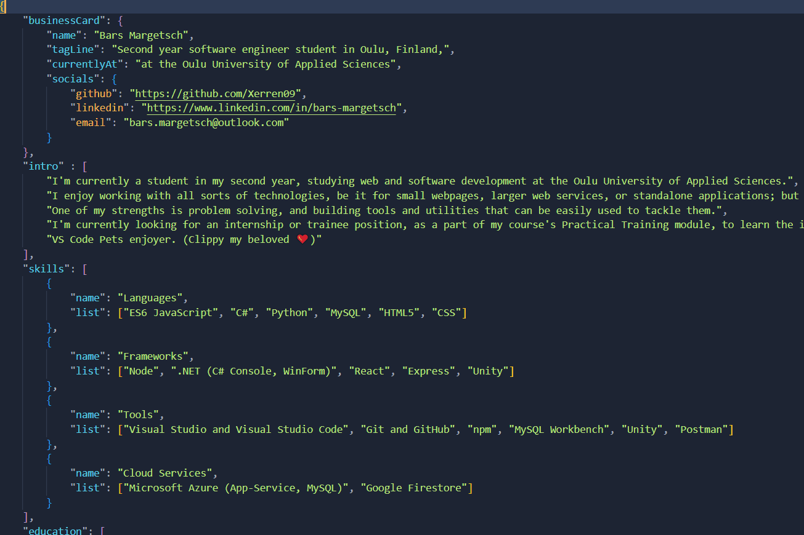

# Personal portfolio

I've started working on this portfolio site around the start of my second year in university with the goal of creating a page to show off my projects, and building upon it over time. Altough I'm not particularly at home with frontend webdesign, I wanted to build something cool, while also learning a bunch of new things.

This is meant to be a personal project so it is highly tailored for myself, but feel free to use it as a base start for your own page (**with attribution of course**).

It is currently live on [barsmargetsch.net](https://barsmargetsch.net/).

## Setup

* Customise the contents of the `public` folder
  * The `data` folder contains the `contents.json` file
  * Replace `card.png` with an image that should show up as a website preview
  * Edit the `index.html` meta tags for your liking
* Build the app
* Freely edit the `contents.json` file inside `build/data/`, without the need to re-build, to change the contents of the site

## Features

### Light / Dark theme

<div align="center">
    
</div>

Built-in light / dark theme, while keeping accent colours. Automatically changes to the browser's indicated theme preference.

Colours are found in the `App.css` file. Changing the colour map requires a rebuild of the project.


### Mobile layout

<div align="center">
    
</div>

Comes with an elegant and just-as-easy to use mobile layout. Tapping the down arrow below the socials scrolls right down to the contents. 
For mobile, I've opted for a floating theme-switch button, to keep the visuals consistent.

### Easy content editor

<div align="center">
    
</div>

Editing the section contents is as simple as editing a JSON file, and it does not require the project to be rebuilt. The `contents.json` file allows for a fair amount of customization.

#### Business card

Format:
```json
"businessCard": {
    "name": "",
    "tagLine": "",
    "currentlyAt": "",
    "socials": {
        "github": "",
        "linkedin": "",
        "email": ""
    }
},
```

This section appears on the left side (or on the cover in the mobile layout), over the profile image. The socials section is manually customsable, since it relies on icons (FontAwesome is available by default).

#### Introduction

Format: `"intro" : [""]`

This section is purely an array of strings. For convenience's sake paragraphs can be organised into separate items, which makes them appear as their own `<p>` element.

#### Skills

Format: 
```json
"skills": [
    {
        "name": "",
        "list": [""]
    }
]
```

The skills section consists of multiple named lists, or categories. Simply name the category and add what skills fall under it.

#### Education

Format:
```json
"education": [
    {
        "name": "",
        "url" : "",
        "degree": "",
        "start": "",
        "end": "",
        "comments" : [
            ""
        ]
    }
]
```

Education section elements offer the basic options. The name of the insitution, an optional link to their website, the name of the degree, and the start - end dates. Optionally comments can be added (e.g., what exactly does the course entails).

#### Jobs

Format:
```json
"jobs": [
    {
        "name": "",
        "url" : "",
        "position": "",
        "start": "",
        "end": "",
        "comments" : [
            ""
        ]
    }
]
```

Similar to the education section, with the exception of the `position` field, which behaves identically to the `degree` field.

#### Selected Projects

Format:
```json
"projects": [
    {
        "type": "",
        "url": "",
        "comments": [
            ""
        ]
    }
]
```

This section offers the most customizability, altough it requires custom code to be written, and the project recompiled. It's possible to set up various project types within the `src/framework/sections/projects/types` folder, using the common `projectBase`. This class converts the given URL into a backend API url (replacement strings need to be provided in code), and returns the backend data. This can then be used to display the project information in any form.

By default, only a GitHub converter is given, which takes the repository `About` contents, and the language the project is written in.
Optionally, comments can be added to further describe the project.