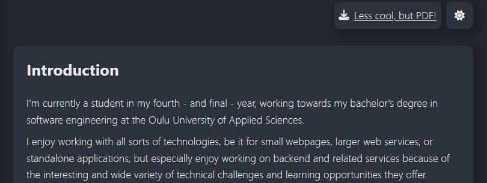

# Personal portfolio

I've started working on this portfolio site around the start of my second year in university with the goal of creating a page to show off my projects, and building upon it over time. It has since been updated a few times to add new features, fix styling issues, and just make it generally better :)

This is meant to be a personal project, so it is mostly tailored for myself, but feel free to use it as a base start for your own page (**with attribution of course**).

It is currently live on [barsmargetsch.net](https://barsmargetsch.net/).

## Features

### Easy content editor

The contents of the page can be easily updated through a single YAML file (chosen over JSON for its more human-friendly syntax). Simply edit the `contents.yaml` file in the `./public/data` (or after building, `./build/data`) folder and hit save! The best part? No need to rebuild the page for the content to update.

### Theming

<div align="center">
    
</div>

Built-in light / dark theme, which Automatically changes to the browser's indicated theme preference. Colours and other global styling options are defined in `./src/index.css` as CSS variables, so tweaking them is easy.

### Mobile layout

<div align="center">
    
</div>

Comes with an elegant and just-as-easy to use mobile layout. Tapping the down arrow below the socials scrolls right down to the contents. 

## Setup

* Customise the contents of the `public` folder
  * The `data` folder contains the `contents.yaml` file
  * Replace `card.png` with an image that should show up as a website preview ([this site is pretty useful for this, check them out!]([a](https://www.opengraph.xyz/)))
  * Edit the `index.html` meta tags for your liking
* Build the app
* Freely edit the `contents.yaml` file inside `build/data/` - without the need to rebuild - to change the contents of the site

## Portfolio Page

#### Contents.yaml

Originally the format was for this was JSON, however the strict syntax made it sometimes annoying to update. YAML is a lot more "bare bones", so it is much friendlier to work with.

#### Cover

Format:
```yaml
cover:
  name: string
  tag: string
  currentlyAt: string
  socials:
    - name: github
      url: https://github.com/Xerren09
    - name: linkedin
      url: https://www.linkedin.com/in/bars-margetsch
  email: string
```

This section appears on the left side (or on the cover in the mobile layout), over the profile image. The socials section can be exapanded, and the `name` property's value will be used as a FontAwesome icon name.

#### Introduction

Format:
```yaml
introduction:
  "
    Paragraph 1

    Paragraph 2

    ...
  "
```

This section is just simple a Markdown text. The content will be rendered into the section's body.

#### Skills

Format: 
```yaml
skills:
  - name: Languages
    items: 
      - C#
      - TypeScript
      - Python
      - PowerShell
      - MySQL
      - HTML & CSS
  - name: Frameworks
    items: 
      - .NET (C# Console, WinForm, WebView2)
      - NodeJS
      - React
      - Angular
      - ExpressJS
      - Unity
```

The skills section consists of multiple named lists, or categories. Simply name the category and add what skills fall under it.

#### Experience and Education

These sections follow the same format:

Format:
```yaml
experience: // for education, just use the key "education" instead of "experience"
  - name: string
    url: url
    title: string
    start: string
    end: string
    comments: 
      "
        Paragraph 1

        Paragraph 2

        ...
      "
```

Comments are optional, although probably a good idea.

#### Showcase

Format:
```yaml
showcase:
  - type: github
    url: https://github.com/Xerren09/Boop
    comments: 
      "
        Paragraph 1

        Paragraph 2

        ...
      "
```

This section offers the most customizability, although it requires custom code to be written, and the page rebuilt. It's possible to set up various project types within the `src/pages/main/projects` folder, using the `ShowCaseProjectTransformer` interface. This object should return a given component for the given project type.

Once a tranformer is written, pass it in `src\pages\main\portfolio-page.tsx`, in the transformers prop of the `ShowCase` component:

```ts
    <ShowCase 
        data={data.showcase} 
        transformers={[
            GithubProjectTransformer
        ]}
    />
```

By default, only a GitHub transformer is given, which takes the repository `About` contents, and the language the project is written in.
Optionally, comments can be added to further describe the project.

#### CV

It's probably a good idea to also provide a PDF version of this page. Recruiters and hiring managers tend to love an actual real file that doesn't change or disappear overnight. If you think that's also reasonable, pass a line to the end of the contents file:

```yaml
pdf: path/to/your/cv.pdf
```

This will put a link on the top of the page, next to the theme toggle so they can download it :)

## Posts

In addition to a simple portfolio page, the app also supports posts. These are meant to be used to provide details _for_ the things on the main page, so they aren't particularly feature rich, which I think is fine for the scope of this.

First, edit the `./public/data/blog/header.yaml` or `./build/data/blog/header.yaml` file to include the name and tagline:

```yaml
name: string
tag: string
```

Then, to create a new post, simply make a new folder with the post's name (make it URL compatible) and create a `meta.yaml`:

```yaml
title: string
date: string
```

Then a `post.md` file, which will be the content of the post. Any assets the markdown file uses can be simply left in the same folder as this file.